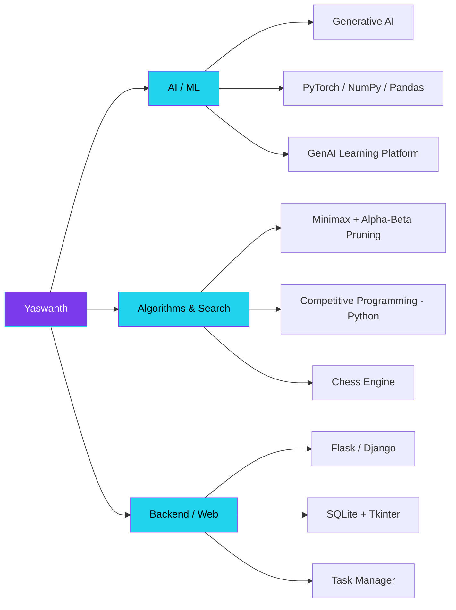

<div align="center">


<a href="https://git.io/typing-svg">
  
</a>

<br/>

<a href="https://linkedin.com/in/sampathi-yaswanth"></a>
<a href="mailto:yaswanthsampathi@gmail.com"></a>
<a href="https://github.com/yashu440"></a>
<a href="https://leetcode.com/yashu440"></a>


<br/><br/>

<a href="#-about-me">About</a> •
<a href="#%EF%B8%8F-skill-architecture">Skill Architecture</a> •
<a href="#%EF%B8%8F-featured-projects">Projects</a> •
<a href="#-tech-stack">Tech Stack</a> •
<a href="#-competitive-programming">Competitive Programming</a> •
<a href="#-github-analytics">Analytics</a> •
<a href="#-lets-connect">Connect</a>

</div>

<br/>

## 👋 About Me

I'm a Computer Science student at **Kalasalingam Academy of Research and Education**, focused on **applied AI/ML and algorithmic systems**. I enjoy the problems where intelligence meets engineering — search algorithms with real game-tree pruning, generative AI features wired into production-style web apps, and the kind of competitive programming that forces clean, correct code under pressure.

```python
class Yaswanth:
    def __init__(self):
        self.role        = "CSE Student @ Kalasalingam Academy of Research and Education"
        self.focus       = ["AI/ML Engineering", "Algorithms & Search", "Applied GenAI"]
        self.building    = "AI-integrated, algorithmically-grounded web applications"
        self.learning    = ["Advanced ML systems", "Competitive programming (Python)"]
        self.collab_open = ["AI/ML research", "Algorithmic projects", "Open source"]

    def reach_me_about(self):
        return ["Python", "Machine Learning", "Game AI / Search", "Flask", "Java"]

me = Yaswanth()
```

<table>
<tr>
<td width="50%" valign="top">

### 🎯 Currently
- 🔭 Building AI-integrated web applications
- 🌱 Sharpening ML fundamentals & competitive programming
- 🤝 Open to AI/ML research & algorithmic collaborations
- 💬 Ask me about Python, search algorithms, or generative AI

</td>
<td width="50%" valign="top">

### 📈 Goals
- 🎓 Go deeper into applied Machine Learning
- 🧠 Push further into algorithmic problem solving (CP)
- 🛠️ Ship production-grade AI-powered projects
- 🚀 Land impactful research / AI engineering roles

</td>
</tr>
</table>

---

## 🗺️ Skill Architecture



<div align="center">
<sub>📌 GitHub renders Mermaid diagrams natively in READMEs — no extra setup needed.</sub>
</div>

---

## 🛠️ Featured Projects

<table>
<tr>
<td width="33%" valign="top">

<h3 align="center">♟️ Chess Engine</h3>

A chess move-evaluation engine built around **minimax search with alpha-beta pruning** for efficient, intelligent gameplay decisions.

<div align="center">

`Python` `Algorithms` `Game AI`


[**View Repo →**](https://github.com/yashu440/chess-engine)

</div>
</td>
<td width="33%" valign="top">

<h3 align="center">🤖 GenAI Learning Platform</h3>

A Flask web platform that uses **generative AI** to deliver personalized, adaptive learning experiences for students.

<div align="center">

`Flask` `Python` `GenAI`


[**View Repo →**](https://github.com/yashu440/genai-learning-platform)

</div>
</td>
<td width="33%" valign="top">

<h3 align="center">✅ Task Manager</h3>

A desktop productivity app with full **CRUD** functionality, persistent local storage, and a clean Tkinter interface.

<div align="center">

`Python` `SQLite` `Tkinter`


[**View Repo →**](https://github.com/yashu440/task-manager)

</div>
</td>
</tr>
</table>

<div align="center">
<sub>📌 Swap in your real repo URLs above once they're public.</sub>
</div>

---

## 💻 Tech Stack

<div align="center">

**Languages**
<br/>


**AI / ML / Data** — *primary focus*
<br/>
&nbsp;


**Frameworks & Backend**
<br/>


**Cloud, Hosting & DevOps**
<br/>


**Design**
<br/>
&nbsp;


</div>

---

## ⚡ Skill Proficiency

<div align="center">

| Skill | Proficiency |
|---|---|
| Python |  |
| Machine Learning |  |
| Algorithms / Search (minimax, pruning) |  |
| Flask / Django |  |
| Java |  |
| SQL |  |

<sub>📌 Adjust the numbers in each URL to reflect your real comfort level.</sub>

</div>

---

## 🏆 Competitive Programming

<div align="center">

</div>

<div align="center">
<sub>📌 Replace <code>yashu440</code> with your real LeetCode handle so the card pulls your live stats.</sub>
</div>

---

## 📊 GitHub Analytics

<div align="center">


</div>

<div align="center">

</div>

<div align="center">

</div>

<div align="center">

</div>

### ⏱️ Weekly Coding Activity (WakaTime)

<!--START_SECTION:waka-->
```text
Python      ████████████████░░░░░░░░   62.4%
Java        ██████░░░░░░░░░░░░░░░░░░   24.1%
HTML/CSS    ███░░░░░░░░░░░░░░░░░░░░░   10.0%
Other       █░░░░░░░░░░░░░░░░░░░░░░░    3.5%
```
<!--END_SECTION:waka-->

<div align="center">
<sub>📌 This block auto-updates if you add the <a href="https://github.com/athul/waka-readme">waka-readme</a> GitHub Action with your WakaTime API key.</sub>
</div>

### 🌍 Visitor Map

<div align="center">

</div>

<div align="center">
<sub>📌 ClustrMaps requires a free signup at clustrmaps.com to generate your real embed code — replace the placeholder ID above.</sub>
</div>

<!-- Contribution snake — requires a GitHub Action to generate this asset on your repo. See: https://github.com/Platane/snk -->
<div align="center">

<br/>
<sub>📌 This snake animation needs a small GitHub Action set up on your profile repo — ask me if you want the workflow file.</sub>
</div>

---

## 🤝 Let's Connect

<div align="center">

<a href="https://linkedin.com/in/sampathi-yaswanth"></a>
<a href="mailto:yaswanthsampathi@gmail.com"></a>
<a href="https://github.com/yashu440"></a>

<br/><br/>


</div>
