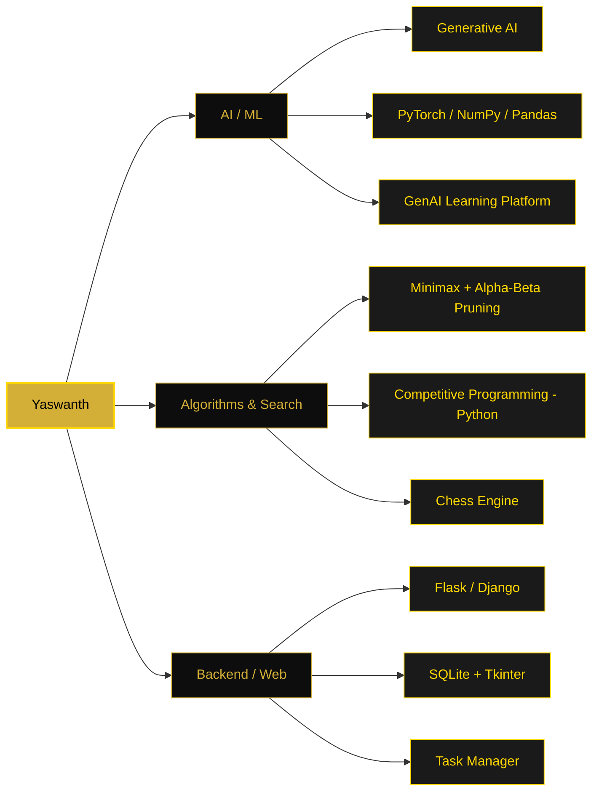
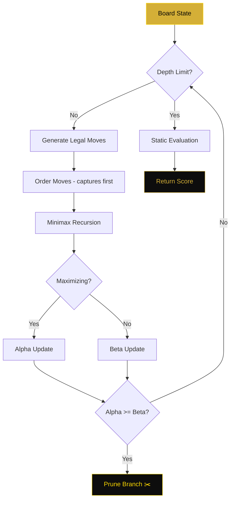
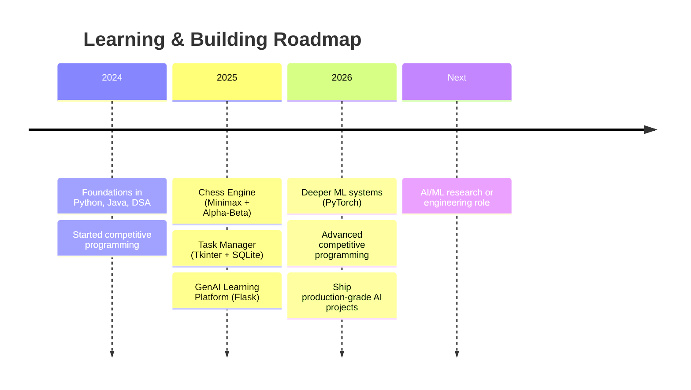

<div align="center">


<a href="https://git.io/typing-svg">
  
</a>

<br/>


<br/><br/>

<a href="https://linkedin.com/in/sampathi-yaswanth-a620ba37a"></a>
<a href="mailto:yaswanthsampathi@gmail.com"></a>
<a href="https://github.com/yashu440"></a>


<br/><br/>

<a href="#-about-me"></a>
<a href="#%EF%B8%8F-skill-architecture"></a>
<a href="#%EF%B8%8F-featured-projects"></a>
<a href="#-tech-stack"></a>
<a href="#-github-analytics"></a>
<a href="#-roadmap"></a>
<a href="#-lets-connect"></a>

</div>

<br/>

<div align="center">

</div>

<br/>

## 👋 About Me

I'm a Computer Science student at **Kalasalingam Academy of Research and Education**, focused on **applied AI/ML and algorithmic systems**. I enjoy the problems where intelligence meets engineering — search algorithms with real game-tree pruning, generative AI features wired into production-style web apps, and the kind of competitive programming that forces clean, correct code under pressure.

```bash
yaswanth@dev:~$ whoami
> CSE student, AI/ML engineer-in-training, algorithm enthusiast

yaswanth@dev:~$ cat current_focus.txt
> Building AI-integrated web apps + sharpening search/CP fundamentals

yaswanth@dev:~$ echo $STATUS
> shipping something, probably at 1 AM
```

```python
class Yaswanth:
    def __init__(self):
        self.role        = "CSE Student @ Kalasalingam Academy of Research and Education"
        self.focus       = ["AI/ML Engineering", "Algorithms & Search", "Applied GenAI"]
        self.building    = "AI-integrated, algorithmically-grounded web applications"
        self.learning    = ["Advanced ML systems", "Competitive programming (Python)"]
        self.collab_open = ["AI/ML research", "Algorithmic projects", "Open source"]

    def reach_me_about(self):
        return ["Python", "Machine Learning", "Game AI / Search", "Flask", "Java"]

    def __repr__(self):
        return f"<Yaswanth focus={self.focus[0]} status='building'>"

me = Yaswanth()
```

<table width="100%">
<tr>
<td width="50%" valign="top">

<div align="center">

### 🎯 Currently

</div>

- 🔭 Building AI-integrated web applications
- 🌱 Sharpening ML fundamentals & competitive programming
- 🤝 Open to AI/ML research & algorithmic collaborations
- 💬 Ask me about Python, search algorithms, or generative AI

</td>
<td width="50%" valign="top">

<div align="center">

### 📈 Goals

</div>

- 🎓 Go deeper into applied Machine Learning
- 🧠 Push further into algorithmic problem solving (CP)
- 🛠️ Ship production-grade AI-powered projects
- 🚀 Land impactful research / AI engineering roles

</td>
</tr>
</table>

<div align="right"><sub><a href="#">↑ back to top</a></sub></div>

<div align="center">

</div>

## 🗺️ Skill Architecture



<div align="center">
<sub>📌 GitHub renders Mermaid diagrams natively in READMEs — no extra setup needed.</sub>
</div>

<div align="right"><sub><a href="#">↑ back to top</a></sub></div>

<div align="center">

</div>

## 🛠️ Featured Projects

<table width="100%">
<tr>
<td width="33%" valign="top">

<div align="center">

<h3>♟️ Chess Engine</h3>

A chess move-evaluation engine built around **minimax search with alpha-beta pruning** for efficient, intelligent gameplay decisions.

<br/>


<br/><br/>


<br/>

[**View Repo →**](https://github.com/yashu440/chess-engine)

</div>
</td>
<td width="33%" valign="top">

<div align="center">

<h3>🤖 GenAI Learning Platform</h3>

A Flask web platform that uses **generative AI** to deliver personalized, adaptive learning experiences for students.

<br/>


<br/><br/>


<br/>

[**View Repo →**](https://github.com/yashu440/genai-learning-platform)

</div>
</td>
<td width="33%" valign="top">

<div align="center">

<h3>✅ Task Manager</h3>

A desktop productivity app with full **CRUD** functionality, persistent local storage, and a clean Tkinter interface.

<br/>


<br/><br/>


<br/>

[**View Repo →**](https://github.com/yashu440/task-manager)

</div>
</td>
</tr>
</table>

<div align="center">
<sub>📌 Swap in your real repo URLs above once they're public.</sub>
</div>

### 🧠 Chess Engine — Architecture Peek



<div align="center">
<sub>📌 Sample diagram of the search/prune loop — replace with your actual engine's flow if it differs.</sub>
</div>

<div align="center">

[](https://star-history.com/#yashu440/chess-engine&Date)

<sub>📌 Star History tracks one repo at a time — pick whichever project you want to showcase growth for, or remove this if the repos are too new to show a meaningful curve yet.</sub>

</div>

<div align="right"><sub><a href="#">↑ back to top</a></sub></div>

<div align="center">

</div>

## 💻 Tech Stack

<div align="center">

**Languages**
<br/>


<br/>

**AI / ML / Data** — *primary focus*
<br/>
&nbsp;


<br/>

**Frameworks & Backend**
<br/>


<br/>

**Cloud, Hosting & DevOps**
<br/>


<br/>

**Design**
<br/>
&nbsp;


</div>

<div align="center">

</div>

## ⚡ Skill Proficiency

<div align="center">

| Skill | Proficiency |
|:---|:---|
| Python |  |
| Machine Learning |  |
| Algorithms / Search (minimax, pruning) |  |
| Flask / Django |  |
| Java |  |
| SQL |  |

<sub>📌 Adjust the numbers in each URL to reflect your real comfort level.</sub>

<br/><br/>


<br/>
<sub>📌 Radar view of the same numbers above — generated live via <a href="https://quickchart.io">QuickChart</a>. Edit the <code>data:[...]</code> values in the URL to match your own.</sub>

</div>

<div align="right"><sub><a href="#">↑ back to top</a></sub></div>

<div align="center">

</div>

## 📊 GitHub Analytics

<div align="center">


[](https://github.com/yashu440?tab=repositories)

<sub>📌 The live "Profile Views" hit-counter (countapi.xyz) has been retired by its provider — the <code>komarev.com/ghpvc</code> badge at the very top of this README is the working replacement and already covers that.</sub>

</div>

<table align="center" width="100%">
<tr>
<td valign="top" width="50%">


</td>
<td valign="top" width="50%">


</td>
</tr>
<tr>
<td colspan="2" valign="top">

<div align="center">

</div>

</td>
</tr>
</table>

<details>
<summary>📌 <b>Optional: WakaTime card</b> — click to expand</summary>

<br/>

The card below only renders once `yashu440` has a **public** WakaTime profile (free account at <a href="https://wakatime.com">wakatime.com</a>, then make it public in WakaTime settings). Until then it shows a "could not resolve user" error, so it's kept out of the main grid above.


</details>

### 📈 Contribution Activity

<div align="center">

</div>

### 🗓️ Isometric Contribution Calendar

<div align="center">

<br/>
<sub>📌 Isometric calendar via the lowlighter/metrics-style stats card — falls back gracefully if unsupported by your renderer.</sub>
</div>

### 🧩 Competitive Programming

<details>
<summary>📌 <b>Optional: LeetCode / Codeforces cards</b> — click to expand</summary>

<br/>

Drop in your real handles and uncomment/use these once ready — both render live, gold/black themed:

**LeetCode** (replace `your-leetcode-handle`):
```md

```

**Codeforces** (replace `your-codeforces-handle`):
```md

```

<sub>Both services are third-party and occasionally rate-limited like the GitHub stats cards above — if a card doesn't render on first load, refresh the page.</sub>

</details>

### 🏆 Trophy Case

<div align="center">

</div>

<div align="center">
<sub>📌 "gruvbox" gives the warmest amber/gold tone among built-in trophy themes — swap to any theme listed in the <a href="https://github.com/ryo-ma/github-profile-trophy#themes">github-profile-trophy docs</a> if you want a closer match.</sub>
</div>

### ⏱️ Weekly Coding Activity (WakaTime)

<!--START_SECTION:waka-->
```text
Python      ████████████████░░░░░░░░   62.4%
Java        ██████░░░░░░░░░░░░░░░░░░   24.1%
HTML/CSS    ███░░░░░░░░░░░░░░░░░░░░░   10.0%
Other       █░░░░░░░░░░░░░░░░░░░░░░░    3.5%
```
<!--END_SECTION:waka-->

<div align="center">
<sub>📌 This block auto-updates if you add the <a href="https://github.com/athul/waka-readme">waka-readme</a> GitHub Action with your WakaTime API key.</sub>
</div>

### 🐍 Contribution Snake

<div align="center">

<picture>
  <source media="(prefers-color-scheme: dark)" srcset="https://raw.githubusercontent.com/yashu440/yashu440/output/github-contribution-grid-snake-dark.svg" />
  <source media="(prefers-color-scheme: light)" srcset="https://raw.githubusercontent.com/yashu440/yashu440/output/github-contribution-grid-snake.svg" />
  
</picture>

</div>

<details>
<summary>📌 <b>Setup (one-time, ~2 min)</b> — click to expand</summary>

<br/>

1. Create a repo named exactly `yashu440` (a "profile repo" — same name as your username).
2. In that repo, go to **Settings → Actions → General** and enable Read/write workflow permissions.
3. Add this file as `.github/workflows/snake.yml`:

```yaml
name: generate-snake
on:
  schedule:
    - cron: "0 0 * * *"
  push:
    branches: [ main ]
  workflow_dispatch: {}

permissions:
  contents: write

jobs:
  generate:
    runs-on: ubuntu-latest
    steps:
      - uses: Platane/snk@v3
        with:
          github_user_name: yashu440
          outputs: |
            dist/github-contribution-grid-snake.svg
            dist/github-contribution-grid-snake-dark.svg?palette=github-dark
      - uses: crazy-max/ghaction-github-pages@v4
        with:
          target_branch: output
          build_dir: dist
        env:
          GITHUB_TOKEN: ${{ secrets.GITHUB_TOKEN }}
```

4. Push it — the action runs and the snake SVGs land on the `output` branch, exactly where the image links above already point.

<br/>

💡 **Want a gold-toned snake instead of the default green?** Use a custom palette by replacing the `outputs` block above with:

```yaml
outputs: |
  dist/github-contribution-grid-snake.svg?palette=github
  dist/github-contribution-grid-snake-dark.svg?colors=0d0d0d,3d2f0a,7a5c12,d4af37,ffd700
```

The `colors=` list goes from emptiest to busiest contribution day, so it fades from black into gold.

</details>

<div align="right"><sub><a href="#">↑ back to top</a></sub></div>

<div align="center">

</div>

## 📜 Certifications & Achievements

<div align="center">

| Certificate / Achievement | Issuer | Year |
|:---|:---|:---:|
| 🏅 Add your certificate title here | Issuing platform | 20XX |
| 🏅 Add your certificate title here | Issuing platform | 20XX |
| 🏅 Add your certificate title here | Issuing platform | 20XX |

<sub>📌 Replace these placeholder rows with real certifications (Coursera, NPTEL, hackathon wins, etc.) — link each title to the credential URL if public.</sub>

</div>

<div align="right"><sub><a href="#">↑ back to top</a></sub></div>

<div align="center">

</div>

## 🧭 Roadmap



<div align="center">
<sub>📌 GitHub renders <code>timeline</code> Mermaid diagrams too — update the milestones as your journey progresses.</sub>
</div>

<div align="right"><sub><a href="#">↑ back to top</a></sub></div>

<div align="center">

</div>

### 🌍 Visitor Map

<div align="center">


</div>

<div align="center">

</div>

<details>
<summary>📌 <b>Setup (one-time, ~1 min)</b> — click to expand</summary>

<br/>

1. Go to <a href="https://clustrmaps.com">clustrmaps.com</a> and sign up free.
2. Add a new map for your GitHub profile URL — `https://github.com/yashu440`.
3. Copy the embed snippet ClustrMaps gives you and swap the `d=` query param in the `` src above with your real one (the `cl=`, `co=`, and `ct=` params above are already set to black/gold).
4. The world map then fills in live as people view your profile.

The **Live Visitors** badge above works immediately with zero setup — it's a simple hit counter as a stopgap while the world map populates.

</details>

<div align="right"><sub><a href="#">↑ back to top</a></sub></div>

<div align="center">

</div>

## ☕ Support

<div align="center">

<a href="https://www.buymeacoffee.com/yashu440"></a>
<a href="https://github.com/sponsors/yashu440"></a>

<sub>📌 Both links are placeholders — enable GitHub Sponsors in your account settings and/or create a Buy Me a Coffee page, then these badges go live automatically.</sub>

</div>

<div align="right"><sub><a href="#">↑ back to top</a></sub></div>

<div align="center">

</div>

## 🤝 Let's Connect

<div align="center">

> *"The best way to learn is to build, break, and rebuild — better."*

<br/>

<a href="https://linkedin.com/in/sampathi-yaswanth-a620ba37a"></a>
<a href="mailto:yaswanthsampathi@gmail.com"></a>
<a href="https://github.com/yashu440"></a>

<br/><br/>

<sub>⚡ Thanks for stopping by — feel free to star a repo or drop a message.</sub>

<br/><br/>


</div>
