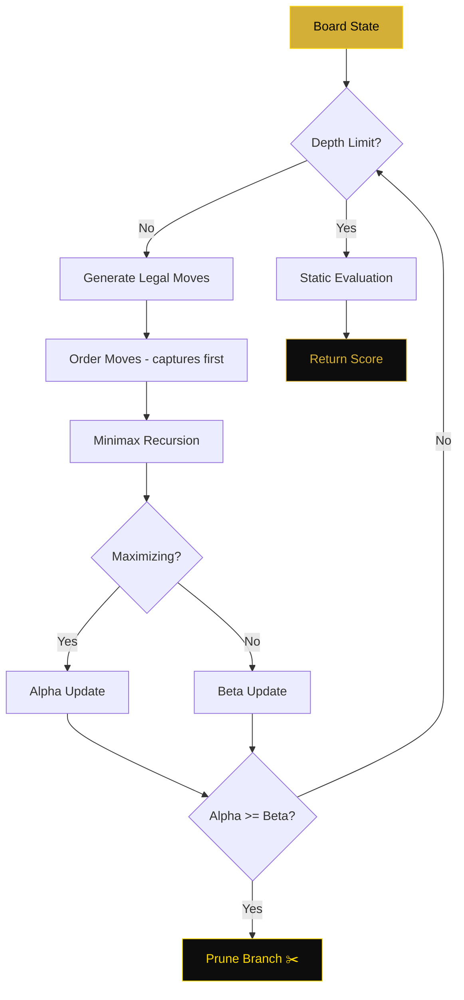
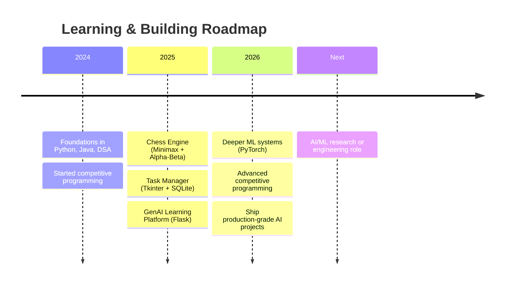

<div align="center">


<a href="https://git.io/typing-svg">
  
</a>

<br/>


<br/><br/>

<a href="https://www.linkedin.com/in/sampathi-yaswanth-a620ba37a/"></a>
<a href="mailto:yaswanthsampathi@gmail.com"></a>
<a href="https://github.com/yashu440"></a>
<a href="https://www.instagram.com/_yashu.__07"></a>
<a href="https://yashuuu.ai.studio"></a>


<br/><br/>

<!-- Quick stat pills -->
<table>
<tr>
<td align="center"></td>
<td align="center"></td>
<td align="center"></td>
<td align="center"></td>
</tr>
</table>

<br/>

<a href="#-about-me"></a>
<a href="#%EF%B8%8F-featured-projects"></a>
<a href="#-tech-stack"></a>
<a href="#-github-analytics"></a>
<a href="#-roadmap"></a>
<a href="#-lets-connect"></a>

<br/><br/>

<!-- Live portfolio callout -->
<a href="https://yashuuu.ai.studio">

</a>

</div>

<br/>

<div align="center">

</div>

<br/>

## 👋 About Me

I'm a Computer Science student at **Kalasalingam Academy of Research and Education**, focused on **applied AI/ML and algorithmic systems**. I enjoy the problems where intelligence meets engineering — search algorithms with real game-tree pruning, generative AI features wired into production-style web apps, and the kind of competitive programming that forces clean, correct code under pressure.

```bash
yaswanth@dev:~$ whoami
> CSE student, AI/ML engineer-in-training, algorithm enthusiast

yaswanth@dev:~$ cat current_focus.txt
> Building AI-integrated web apps + sharpening search/CP fundamentals

yaswanth@dev:~$ echo $STATUS
> shipping something, probably at 1 AM

yaswanth@dev:~$ uptime
> up 2 years, still compiling ambition
```

```python
class Yaswanth:
    def __init__(self):
        self.role        = "CSE Student @ Kalasalingam Academy of Research and Education"
        self.focus       = ["AI/ML Engineering", "Algorithms & Search", "Applied GenAI"]
        self.building    = "AI-integrated, algorithmically-grounded web applications"
        self.learning    = ["Advanced ML systems", "Competitive programming (Python)"]
        self.collab_open = ["AI/ML research", "Algorithmic projects", "Open source"]

    def reach_me_about(self):
        return ["Python", "Machine Learning", "Game AI / Search", "Flask", "Java"]

    def __repr__(self):
        return f"<Yaswanth focus={self.focus[0]} status='building'>"

me = Yaswanth()
```

<table width="100%">
<tr>
<td width="33%" valign="top">

<div align="center">

### 🎯 Currently

</div>

- 🔭 Building AI-integrated web applications
- 🌱 Sharpening ML fundamentals & competitive programming
- 🤝 Open to AI/ML research & algorithmic collaborations
- 💬 Ask me about Python, search algorithms, or generative AI

</td>
<td width="33%" valign="top">

<div align="center">

### 📈 Goals

</div>

- 🎓 Go deeper into applied Machine Learning
- 🧠 Push further into algorithmic problem solving (CP)
- 🛠️ Ship production-grade AI-powered projects
- 🚀 Land impactful research / AI engineering roles

</td>
<td width="33%" valign="top">

<div align="center">

### ✨ Fun Facts

</div>

- ♟️ Thinks in game trees, even off the board
- 🌙 Most productive between 11 PM – 2 AM
- 📐 Believes clean code is a form of respect
- ☕ Debugs better with coffee, worse without it

</td>
</tr>
</table>

<div align="right"><sub><a href="#">↑ back to top</a></sub></div>

<div align="center">

</div>

## 🛠️ Featured Projects

<table width="100%">
<tr>
<td width="33%" valign="top">

<div align="center">

<h3>♟️ Chess Engine</h3>

A chess move-evaluation engine built around **minimax search with alpha-beta pruning** for efficient, intelligent gameplay decisions.

<br/>


<br/><br/>


<br/>

[**View Repo →**](https://github.com/yashu440/chess-engine)

</div>
</td>
<td width="33%" valign="top">

<div align="center">

<h3>🤖 GenAI Learning Platform</h3>

A Flask web platform that uses **generative AI** to deliver personalized, adaptive learning experiences for students.

<br/>


<br/><br/>


<br/>

[**View Repo →**](https://github.com/yashu440/genai-learning-platform)

</div>
</td>
<td width="33%" valign="top">

<div align="center">

<h3>✅ Task Manager</h3>

A desktop productivity app with full **CRUD** functionality, persistent local storage, and a clean Tkinter interface.

<br/>


<br/><br/>


<br/>

[**View Repo →**](https://github.com/yashu440/task-manager)

</div>
</td>
</tr>
</table>

<div align="center">
<sub>📌 Swap in your real repo URLs above once they're public.</sub>
</div>

### 🧠 Chess Engine — Architecture Peek


```mermaid
flowchart TD
    A[Board State] --> B{Depth Limit?}
    B -- No --> C[Generate Legal Moves]
    C --> D[Order Moves - captures first]
    D --> E[Minimax Recursion]
    E --> F{Maximizing?}
    F -- Yes --> G[Alpha Update]
    F -- No --> H[Beta Update]
    G --> I{Alpha >= Beta?}
    H --> I
    I -- Yes --> J[Prune Branch ✂️]
    I -- No --> B
    B -- Yes --> K[Static Evaluation]
    K --> L[Return Score]

    style A fill:#D4AF37,stroke:#FFD700,color:#000
    style J fill:#0D0D0D,stroke:#FFD700,color:#FFD700
    style L fill:#0D0D0D,stroke:#D4AF37,color:#D4AF37
```

<div align="center">

[](https://star-history.com/#yashu440/chess-engine&Date)

<sub>📌 Star History tracks one repo at a time — pick whichever project you want to showcase growth for.</sub>

</div>

<div align="right"><sub><a href="#">↑ back to top</a></sub></div>

<div align="center">

</div>

## 💻 Tech Stack

<div align="center">

**Languages**
<br/>


<br/>

**AI / ML / Data** — *primary focus*
<br/>
&nbsp;


<br/>

**Frameworks & Backend**
<br/>


<br/>

**Cloud, Hosting & DevOps**
<br/>


<br/>

**Design**
<br/>
&nbsp;


</div>

<div align="center">

</div>

## ⚡ Skill Proficiency

<div align="center">

| Skill | Proficiency |
|:---|:---|
| Python |  |
| Machine Learning |  |
| Algorithms / Search (minimax, pruning) |  |
| Flask / Django |  |
| Java |  |
| SQL |  |

<sub>📌 Adjust the numbers in each URL to reflect your real comfort level.</sub>

<br/><br/>


<br/>
<sub>📌 Radar view of the same numbers above — generated live via <a href="https://quickchart.io">QuickChart</a>.</sub>

</div>

<div align="right"><sub><a href="#">↑ back to top</a></sub></div>

<div align="center">

</div>

## 📊 GitHub Analytics

<div align="center">


[](https://github.com/yashu440?tab=repositories)

</div>

<table align="center" width="100%">
<tr>
<td valign="top" width="50%">


</td>
<td valign="top" width="50%">


</td>
</tr>
<tr>
<td colspan="2" valign="top">

<div align="center">

</div>

</td>
</tr>
</table>

### 📈 Contribution Activity

<div align="center">

</div>

<br/>

<div align="center">

<details>
<summary><b>🏆 Trophy Case</b> — click to expand</summary>
<br/>

</details>

</div>

<div align="right"><sub><a href="#">↑ back to top</a></sub></div>

<div align="center">

</div>

<details>
<summary><h2 style="display:inline">📜 Certifications & Achievements — click to expand</h2></summary>

<div align="center">

| Certificate / Achievement | Issuer | Year |
|:---|:---|:---:|
| 🏅 Add your certificate title here | Issuing platform | 20XX |
| 🏅 Add your certificate title here | Issuing platform | 20XX |
| 🏅 Add your certificate title here | Issuing platform | 20XX |

<sub>📌 Replace with real certifications (Coursera, NPTEL, hackathon wins, etc.) — link each title to the credential URL.</sub>

</div>

</details>

<div align="right"><sub><a href="#">↑ back to top</a></sub></div>

<div align="center">

</div>

## 🧭 Roadmap


```mermaid
timeline
    title Learning & Building Roadmap
    2024 : Foundations in Python, Java, DSA
         : Started competitive programming
    2025 : Chess Engine (Minimax + Alpha-Beta)
         : Task Manager (Tkinter + SQLite)
         : GenAI Learning Platform (Flask)
    2026 : Deeper ML systems (PyTorch)
         : Advanced competitive programming
         : Ship production-grade AI projects
    Next : AI/ML research or engineering role
```

<div align="right"><sub><a href="#">↑ back to top</a></sub></div>

<div align="center">

</div>

### 🌍 Visitor Map

<div align="center">


</div>

<div align="right"><sub><a href="#">↑ back to top</a></sub></div>

<div align="center">

</div>

## ☕ Support

<div align="center">

<a href="https://www.buymeacoffee.com/yashu440"></a>
<a href="https://github.com/sponsors/yashu440"></a>

</div>

<div align="right"><sub><a href="#">↑ back to top</a></sub></div>

<div align="center">

</div>

## 🤝 Let's Connect

<div align="center">

> *"The best way to learn is to build, break, and rebuild — better."*

<br/>

<a href="https://www.linkedin.com/in/sampathi-yaswanth-a620ba37a/"></a>
<a href="mailto:yaswanthsampathi@gmail.com"></a>
<a href="https://github.com/yashu440"></a>
<a href="https://www.instagram.com/_yashu.__07"></a>
<a href="https://yashuuu.ai.studio"></a>

<br/><br/>

<sub>⚡ Thanks for stopping by — feel free to star a repo or drop a message.</sub>

<br/><br/>


</div>
